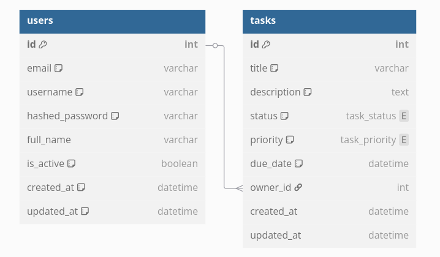

# Task Management Application

A task management application with user authentication, built with FastAPI, JWT, PostgreSQL, SQLAlchemy and Pydantic.

## Features

- User authentication with JWT tokens
- User registration and profile management
- Create, read, update, and delete tasks
- Associate tasks with specific users
- Filter tasks by status and priority

## Tech Stack

### Backend
- FastAPI - Python web framework
- SQLAlchemy - ORM for database interaction
- PostgreSQL - Database
- JWT - Authentication
- Pydantic - Data validation


### Prerequisites

- Python 3.11
- PostgreSQL database

### Setup

1. Clone the repository
```bash
git clone https://github.com/Sagor0078/fastapi-crud-app.git
```
2. Create Virtual Environment:
```bash
python3.11 -m venv env

source env/bin/activate
```
3. Install dependencies:
```bash
cd fastapi-crud-app
pip install -r requirements.txt
```

4. Configure your PostgreSQL database in `.env` like **.env.example**

5. Start the application:
```bash
uvicorn main:app --reload
```

## API Endpoints

- **Authentication**
  - POST `/api/token` - Get authentication token

- **Users**
  - POST `/api/users/` - Create a new user
  - GET `/api/users/` - Get all users
  - GET `/api/users/me` - Get current user
  - GET `/api/users/{user_id}` - Get a specific user
  - PUT `/api/users/{user_id}` - Update a user
  - DELETE `/api/users/{user_id}` - Delete a user

- **Tasks**
  - POST `/api/tasks/` - Create a new task
  - GET `/api/tasks/` - Get all tasks (with optional filtering)
  - GET `/api/tasks/{task_id}` - Get a specific task
  - PUT `/api/tasks/{task_id}` - Update a task
  - DELETE `/api/tasks/{task_id}` - Delete a task

## Project Structure

```
 fastapi-crud-app/
├── alembic.ini
├── database.py
├── main.py
├── models.py
├── requirements.txt
├── schemas.py
├── .env.example.md
├── migrations/
│   └── env.py
└── src/
    └── routers/
        ├── auth.py
        ├── tasks.py
        └── users.py
```

- Apply unit test

```bash
PYTHONPATH=. pytest -v    
```
- for linting and code formatting we used **Ruff**

```bash
pip install ruff


ruff check . --fix && ruff format .
```

- Apply database migrations

- Initial Alembic
```bash
alembic init migrations
```
- Generate Migration Script
```bash
alembic revision --autogenerate -m "Initial migration"
```
- Apply Migrations
```bash
alembic upgrade head
```
database diagram for users and tasks tables, showing their fields and the one-to-many relationship:

[](https://github.com/Sagor0078/fastapi-crud-app)

- To generate a 32-byte (256-bit) secret key using openssl, run:
```bash
openssl rand -hex 32
```
